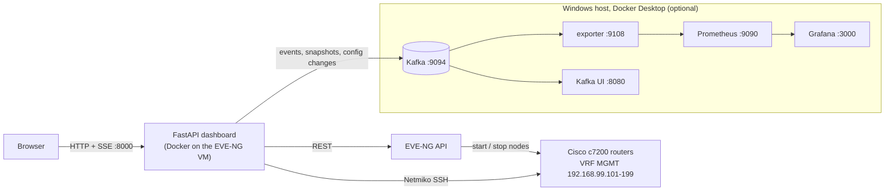

# BGP Attributes Executor


A hands-on BGP platform on **EVE-NG** with real Cisco IOS routers (7206VXR / c7200, Dynamips): click **Run** on a scenario and the platform starts that scenario's own lab,
configures the routers over SSH, verifies the result and shows it in 3D. It has five parts that share the same lab files:

| Part | What it is | Where |
|---|---|---|
| **Live labs** | Run any of **31 scenarios** (11 BGP attributes, 6 MPLS VPN use cases and their variants) on **its own topology**: the VM switches labs for you, with a **3D topology view**, live BGP session state and a **live SSH/CLI transcript** | `http://<eve-vm>:8000/` (default tab), [`docs/live-labs.md`](docs/live-labs.md) |
| **Shared lab** | The original 8-router lab and its 11 scenarios, with before/after `show` diffs and a session monitor. It is now one of the 18 labs in Live labs | [`backend/`](backend/), [`frontend/`](frontend/) |
| **Learn tab** | A from-scratch-to-pro course: 11 attributes plus an MP-BGP / MPLS VPN track, with diagrams, **3D lab views with an animated packet path**, exercises, drills, quizzes, cheat-sheets and a best-path simulator | `http://<eve-vm>:8000/#learn` |
| **Credentials tab** | The login and enable password of every router in all 18 labs (hidden until you click Reveal), each with an **SSH session** button that opens the router in its own PuTTY window | `http://<eve-vm>:8000/#cred` |
| **17 standalone labs** | One small EVE lab per topic (3 to 7 routers), each with a README, every router's configuration, and a scenario you can apply and roll back | [`labs/`](labs/) |

Everything below links to files in this repository. If you are reading this on GitHub, the links open the files directly.

## Contents

* [What's new](#whats-new) · [Start here](#start-here) · [The dashboard at a glance](#the-dashboard-at-a-glance)
* [Architecture](#architecture) · [Tech stack](#tech-stack)
* [Live labs](#live-labs-any-scenario-on-its-own-topology) · [The Learn tab](#the-learn-tab) · [The shared 8-router lab](#the-shared-8-router-lab) · [The 17 standalone labs](#the-17-standalone-labs) · [How to work with a lab](#how-to-work-with-a-lab)
* [Prerequisites](#prerequisites) · [Quick start](#quick-start-deploy-the-platform) · [Configuration reference](#configuration-reference)
* [Repo layout](#repo-layout) · [Monitoring](#monitoring-kafka---prometheus---grafana) · [Troubleshooting](#troubleshooting) · [More documentation](#more-documentation) · [License](#license)

## What's new

### Running scenarios

* **Live labs tab (the default, and the only place scenarios run).** One click on **Run** takes a scenario from "which lab is that?" to a verified result: the dashboard stops the running lab, starts the scenario's own
  topology, waits for the routers, checks their baseline and BGP, pushes the change over SSH, verifies it, and rolls it back on request. [Details](#live-labs-any-scenario-on-its-own-topology).
* **The old Lab tab is gone.** Run always uses each scenario's own lab; `#lab` now opens `#live/shared`. The shared 8-router lab is one of the 18 labs.
* **One lab at a time, managed for you.** A lab manager switches between 18 labs (the 17 standalone labs and the shared lab), rolls back leftovers before leaving a lab, and remembers which labs are
  configured. **Prepare all labs** sets every lab up once, so a later switch is only a boot.
* **Safer automation.** Every SSH session verifies the router's hostname before sending anything, and a lab refuses to start if another router already answers on one of its management addresses.
* **New management addresses: 192.168.99.101 to .199.** The block below .100 belongs to other projects on the same EVE bridge. [Addressing rule](#management-addresses).

### Reaching the routers

* **SSH only.** Routers accept SSH on their management address and nothing else (`transport input ssh`); the dashboard no longer offers telnet consoles. The **EVE-NG** card of Live labs lists every router of the shown lab with its
  EVE-NG state and an **SSH session** button.
* **One PuTTY window per router.** **SSH session** opens that router in its own PuTTY window through a `bgpputty:` link. A one-time script (`scripts/putty-setup.ps1`) creates the 92 saved sessions and the link handler for
  your Windows user only. [How it works](#one-putty-window-per-router).
* **CLI tab.** A **CLI tab** button per router selects it in the SSH / CLI panel, scrolls there and runs `show ip bgp summary` so the panel answers right away; the command box runs any whitelisted read-only `show`.
* **Credentials tab.** Login user, login password and enable secret of all 92 routers in the 18 labs, grouped by lab, hidden until you click Reveal, with Copy buttons and an SSH session button. Values come from each lab's
  `inventory.yaml` and are checked against its baseline (`GET /api/credentials`). [Details](#credentials-tab).
* **See the running lab in the EVE-NG web page.** The dashboard runs labs as the `bgpapi` account in **pod 1**, so an admin in pod -1 sees nothing running. Create a pod-1 account for the web page: [steps](#seeing-the-running-lab-in-the-eve-ng-web-page).

### 3D views

* **3D topology view.** Routers on tiers, physical links, and BGP sessions as arcs (iBGP, eBGP, MP-BGP VPNv4, PE-CE in a VRF) with live up/down state. Every router that receives configuration pulses
  and an "SSH executor" sends a beam to it.
* **Live SSH / CLI transcript.** The real commands, per router, exactly as they are typed: `ssh lab@<address>`, `configure terminal`, each line with the prompt of its config mode, `end`,
  `write memory`, and the `show` commands of the checks with their output.
* **Light or dark 3D scene.** A **Light / Dark** button on the 3D view (Live labs and the Learn pages) switches the scene only, not the rest of the dashboard. The choice is remembered in the browser.
* **3D in the Learn tab.** All 11 attribute pages and all 8 MP-BGP pages have a 3D view of their lab: the routers the scenario configures glow and a packet follows a path across the topology with a caption per hop. [Learn tab](#the-learn-tab).

### Monitoring and documentation

* **Prometheus and Kafka UI in the header.** Next to **Grafana dashboard**, the header has **Prometheus** and **Kafka UI** buttons that open each tool in a new tab, so the whole
  Kafka -> Prometheus -> Grafana chain is one click away during a demo. They default to the Grafana host on `:9090` and `:8080` (`BGP_PROMETHEUS_URL` and `BGP_KAFKA_UI_URL` override them). [Monitoring](#monitoring-kafka---prometheus---grafana).
* **A fuller README.** [Prerequisites](#prerequisites), a [configuration reference](#configuration-reference) with every setting and its default, a [troubleshooting](#troubleshooting) table, a [tech stack](#tech-stack) summary and an architecture diagram.
* **Updated guides.** The [user guide](docs/user-guide.md) has a short monitoring demo (shut a neighbor, watch it in Grafana, Kafka UI and Prometheus), and [`docs/live-labs.md`](docs/live-labs.md) lists the header, the EVE-NG and Verification panels and every endpoint.

### Housekeeping

* **No stale pages.** The dashboard sends `Cache-Control: no-cache` and versions its script URLs, so a browser never runs an old script against a new page. The EVE-NG card and the lab list are only redrawn when their content changes, so clicks are not lost.
* **MIT License** and a [third-party notice](THIRD-PARTY-NOTICES.md) (Three.js, Python dependencies, and a note that the Cisco IOS images are not included).
* **Tests.** Offline tests of the switch workflow, the hostname guard, the retry helper and the credentials list (`backend/tests/`).

---

## Start here

| I want to... | Go to |
|---|---|
| **Run any of the 31 scenarios on its own topology**, with a 3D view and the live SSH commands | the dashboard's **Live labs** tab: [Live labs](#live-labs-any-scenario-on-its-own-topology) |
| **Look up a router's login and enable password** | the dashboard's **Credentials** tab: [Credentials](#credentials-tab) |
| **Open a router in its own PuTTY window** | **SSH session** on Live labs or Credentials, after a one-time [PuTTY setup](#one-putty-window-per-router) |
| **See the running lab in the EVE-NG web page** | [a pod-1 account](#seeing-the-running-lab-in-the-eve-ng-web-page) |
| **New to networking?** Follow a guided path | [`docs/user-guide.md`](docs/user-guide.md): your first hour, a worked lab, reading output, an 8-week study plan |
| **Learn** an attribute or MP-BGP from scratch | the dashboard's **Learn** tab: [how to open it](#the-learn-tab) |
| **Run** the shared 8-router lab's 11 scenarios | **Live labs**, group "Shared 8-router lab": [the shared lab](#the-shared-8-router-lab) |
| **Build a lab by hand** on the router consoles | [`labs/<lab>/CONFIGS.md`](#how-to-work-with-a-lab) (every router's config, ready to paste) |
| **Run a lab with the tooling** (import, start, bootstrap, apply, rollback) | [`labs/labtool.sh`](labs/labtool.sh) and [the labtool section](#2-with-the-tooling-labslabtoolsh) |
| **Import a lab into the EVE web UI** | the `.zip` next to each lab: [import notes](#3-import-through-eve-web-ui) |
| **Deploy the whole platform** | [Quick start](#quick-start-deploy-the-platform) |
| **Watch sessions in Grafana, Prometheus and Kafka UI** | [Monitoring](#monitoring-kafka---prometheus---grafana) |

---

## The dashboard at a glance

| Tab | Address | What it is for |
|---|---|---|
| **Live labs** | `#live`, or `#live/<lab>` (for example `#live/05_med`, `#live/shared`) | Run and roll back scenarios, 3D topology, steps, live SSH / CLI, EVE-NG state and SSH sessions |
| **Learn** | `#learn`, `#learn/05_med/practitioner`, `#learn/simulator` | The course, with 3D lab views |
| **Credentials** | `#cred` | Router logins and enable secrets of all labs |

**Once, on your PC** (each takes a minute; the dashboard works without them):

1. **PuTTY sessions:** run `powershell -ExecutionPolicy Bypass -File scripts\putty-setup.ps1` in the repository folder. It needs PuTTY and the Windows OpenSSH client. [Details](#one-putty-window-per-router).
2. **A pod-1 EVE-NG account** for the EVE web page, if you want to watch the lab canvas: [steps](#seeing-the-running-lab-in-the-eve-ng-web-page).
3. If a page looks out of date after an update, press **Ctrl+Shift+R** once.

---

## Architecture

```
Browser ──> FastAPI :8000 (Docker container on the EVE-NG VM, network_mode: host)
              ├─ Lab manager: 18 labs, switch workflow, run lock, progress events (SSE)
              ├─ EVE-NG REST API   (topology, node start/stop, console ports)
              └─ Netmiko SSH ──> 192.168.99.101-199 ──> each router's FastEthernet0/0 in VRF MGMT
                                        (bridged out of EVE through Cloud1 / pnet1; hostname checked on every login)

Monitoring (optional):  poller (20 s) ─> Kafka :9094 ─> exporter :9108 ─> Prometheus :9090 ─> Grafana :3000
```

* **Backend:** FastAPI + Netmiko + Jinja2. Scenarios are YAML (targets, variables, verify assertions) plus one Jinja2 template each with
  an apply branch and a `` branch.
* **Frontend:** a single-page app in vanilla JavaScript (SSE for live logs), no build step.
* **Labs:** generated `.unl` topology files and per-router baseline configs, driven by the same code through environment variables, so any
  lab folder can be run without changing the backend.

The same picture as a diagram (GitHub renders it):



### Tech stack

| Layer | Technology |
|---|---|
| Network | EVE-NG Community, Cisco 7206VXR (c7200, Dynamips) running IOS 15.2, MPLS / MP-BGP VPNv4 |
| Backend | Python 3.12, FastAPI, Uvicorn, Netmiko and Paramiko (SSH), Jinja2 (scenario templates), PyYAML, httpx (EVE-NG REST) |
| Frontend | Vanilla JavaScript single-page app, Server-Sent Events, Three.js r128 for the 3D views, no build step |
| Monitoring | Apache Kafka 3.8 (KRaft), a Python exporter (confluent-kafka), Prometheus 2.55 with alert rules, Grafana 11.3, Kafka UI |
| Packaging | Docker Compose: one stack on the EVE-NG VM (dashboard), one on Docker Desktop (monitoring) |
| Desktop | PuTTY and the Windows OpenSSH client for the per-router SSH sessions |

---

## Live labs: any scenario on its own topology

The dashboard opens on **Live labs** (`http://<eve-vm-ip>:8000/`). It lists **18 labs and 31 scenarios** in three groups: BGP attributes (labs 01 to 11), MP-BGP and MPLS VPN (labs 12 to 17)
and the shared 8-router lab. Every scenario has **Run** and **Rollback** buttons, and every lab has **View in 3D** and **Start this lab**.

### What happens when you click Run

```
Run 05_med
  1  roll back what a previous run left applied in the lab that is being left
  2  stop the running lab                       (EVE-NG can run only one of these labs at a time)
  3  start lab 05's routers
  4  wait for SSH, and check that each router answers with its own hostname
  5  first-time setup if the lab was never configured (console: hostname, user, SSH key, address)
  6  check that every router has its baseline (push it where it is missing)
  7  wait for every BGP session to come up    (IPv4, MP-BGP VPNv4 and PE-CE sessions in VRFs)
  8  capture the state, push the scenario over SSH, wait for BGP to settle, verify, show the diff
```

Steps 1 to 7 are skipped, and shown as skipped, when the lab is already the running one. **Rollback** runs the same way and puts the lab back at its baseline. Leaving a lab with something still applied
rolls it back first, so every lab is stopped at its baseline.

### The page

| Area | What it shows |
|---|---|
| **Catalogue** (left) | Every lab and scenario. A dot marks the running lab (green), labs that are configured and saved (blue) and labs never configured (grey). **Prepare all labs** sets every lab up once |
| **3D topology** | Routers on tiers (customers or outside, edge, core), physical links, and BGP sessions as arcs: iBGP blue, eBGP orange, MP-BGP VPNv4 magenta, PE-CE in a VRF cyan. Rings are green when a router answers, amber while starting, red when it does not, grey when stopped; a down session turns red. Orbit, zoom, click a router to open its CLI tab. **Rotate**, **Names**, **Light / Dark** and **Reset view** buttons. Any lab can be previewed in 3D without starting it |
| **Steps** | The stages above, each pending, running, done, skipped or failed, with a timer and the reason for a failure |
| **SSH / CLI** | The real SSH sessions, per router, with the prompt highlighted: `$ ssh lab@192.168.99.121`, `PE2#configure terminal`, `PE2(config-vrf)#route-target import 65000:11`, `end`, `write memory`, and the `show` commands of the checks. A box runs whitelisted read-only `show` commands on the selected router; Copy and Clear are there too |
| **EVE-NG** | The EVE path of the shown lab, each router's EVE-NG state, its SSH address, an **SSH session** button (PuTTY) and a **CLI tab** button that selects the router in the SSH / CLI panel and shows its BGP summary |
| **Verification** | Each check with PASS or FAIL and a before/after diff |

A page reload while a run is in progress follows that run from its start: the stream of a run is kept, so a late viewer receives everything.

### Seeing the running lab in the EVE-NG web page

The dashboard controls the routers as the EVE-NG account **`bgpapi`**, which is in **pod 1**. EVE-NG keeps every pod in a separate space, so an account in another pod (for example `admin`, pod -1) never sees these
routers running: their state, canvas and consoles stay empty even though the commands really run on the routers. To see the labs the dashboard starts:

1. In the EVE-NG web page, as `admin`: **System -> User management -> Add new user**. Role **Administrator**, **POD 1**, expiration -1, a password you choose.
2. Log in with that account and open the lab from the folder list (the page shows the path, for example `/03_as_path.unl`). The routers show as running and their consoles open.
3. Use that separate account for the web page. EVE-NG keeps one session per account, so `bgpapi` itself would be logged out whenever the dashboard talks to EVE-NG.

The **EVE-NG** card on the Live labs page lists every router of the shown lab with its EVE-NG state and an **SSH session** button. Routers accept **SSH only** (`transport input ssh`, user `lab`); the management network lives inside the VM, so the sessions go through the VM.

### One PuTTY window per router

The **EVE-NG** card of Live labs and the **Credentials** tab have an **SSH session** button on every router. It opens that router in its own PuTTY window (user `lab`, PuTTY asks for the password: see the Credentials tab).
A web page cannot start programs, so the PC needs a small handler, installed once (your Windows user only, no administrator rights):

```
powershell -ExecutionPolicy Bypass -File scripts\putty-setup.ps1            # install
powershell -ExecutionPolicy Bypass -File scripts\putty-setup.ps1 -DryRun    # show what it would do
powershell -ExecutionPolicy Bypass -File scripts\putty-setup.ps1 -Uninstall
```

The script reads the router list from the dashboard and creates one saved PuTTY session per router, named `BGP <lab> <router>`. PuTTY reaches the router through the EVE-NG VM with the Windows OpenSSH client
(`ssh.exe -W`, your existing key for the VM), because the router addresses only exist inside the VM. It also registers a `bgpputty:` link, which `scripts\putty-launch.ps1` turns into `putty.exe -load "BGP <lab> <router>"`.
The first click makes the browser ask once to allow the link. Run the setup again when labs are added. The password is never stored. The first time you open a router, PuTTY shows its **Security Alert** for the router's host key: click **Accept** (a router that was wiped and rebuilt has a new key, so the alert returns). The sessions use only the algorithms that the routers' IOS 15.2 SSH server offers (DH group14, AES/3DES, RSA), and a 32-bit PuTTY starts the 64-bit `ssh.exe` through `C:\Windows\Sysnative`.

Buttons appear only for routers that answer SSH, that is for the lab that is really running. Without PuTTY, the same works from any terminal:
`ssh -J root@<eve-vm-ip> -o KexAlgorithms=+diffie-hellman-group14-sha1 -o HostKeyAlgorithms=+ssh-rsa -o Ciphers=+aes128-cbc lab@192.168.99.111`.

### Credentials tab

`http://<eve-vm-ip>:8000/#cred` lists every router of all 18 labs (92 routers) with its SSH address, login user, login password and enable secret, one folder per lab, with a filter box.

* Passwords show as dots. **Reveal** shows one, **Reveal all** shows every one, **Copy** puts a value on the clipboard. Leaving the tab hides them again.
* **SSH session** opens the router in its own PuTTY window ([setup](#one-putty-window-per-router)). After the login, type `enable` and the enable secret.
* The values come from each lab's `inventory.yaml`, which is what the dashboard logs in with, and are compared with the login and `enable secret` lines of the router's baseline file. A row says **baseline differs** if they ever disagree (all 92 agree today: user `lab`, password `lab123`, enable `lab123`).
* The tab is read-only. The dots only hide the values on screen: `GET /api/credentials` returns them to anyone who can open the dashboard, which is fine for a private lab VM and something to remember before exposing it.

### Times (measured on the lab VM with four CPUs)

| Situation | Time |
|---|---|
| Switch from the shared lab to lab 12 and run its scenario | under 4 minutes in total (about 135 s of it the scenario, with its BGP settle time) |
| Rollback on the running lab | about 50 s |
| Bring the shared lab up after a VM reboot | about 2 minutes |
| **Prepare all labs** (once): boot blank, console setup, baseline, save, for each of the 18 labs | about 2.5 hours |

The emulated routers are CPU-bound. Other labs running on the same VM (for example a separate OSPF project) slow every step down, and are the main reason a lab can take longer than the figures above.

### Safety rules

1. **The dashboard never talks to a router whose hostname is not the one it expects.** The login is closed without sending anything.
2. **It never starts a lab whose management addresses another router already answers on.** The run stops and names the address and the router that answered.
3. **One run at a time.** A second request is refused with a message.
4. **It stops a lab only through the lab that is really running.** EVE-NG reports the routers of every lab with matching node ids as running, and a stop sent through the wrong lab does nothing.
5. **Slow routers are retried, wrong ones are not.** Baseline pushes are retried up to three times with longer timeouts; a hostname mismatch is never retried.

### Management addresses

This project uses **192.168.99.101 to 192.168.99.199** for router management: the last octet is 100 plus a per-router number (for example EDGE1 is .111, CORE-RR1 is .121, CONTENT is .133). The gateway
192.168.99.1 and the /24 are unchanged. Other projects on the same EVE bridge, such as an OSPF lab on 192.168.99.11 to .14, keep the lower addresses. Two routers with the same address on one bridge answer in turn,
and an automation tool can then configure the wrong one. See [`docs/addressing.md`](docs/addressing.md).

### HTTP API

| Endpoint | What it does |
|---|---|
| `GET /api/catalog` | Every lab with its scenarios, whether it is running, configured, and what is still applied |
| `GET /api/lab/status` | The active lab, `running`, `phase` (`idle` or `switching`) and the run in progress |
| `GET /api/labs/{lab}/graph` | Routers, links and sessions for the 3D view; live state when the lab is running |
| `POST /api/labs/{lab}/scenarios/{id}/run` and `/rollback` | Run or roll back a scenario, switching to the lab first; returns `run_id` |
| `POST /api/labs/{lab}/activate` | Switch to a lab without running a scenario |
| `POST /api/prewarm` | Configure and save every lab once |
| `GET /api/stream/{run_id}` | Server-sent events: `plan`, `step`, `cli`, `log`, `result` |
| `GET /api/credentials` | Login user, password and enable secret of every router of every lab, with whether each matches its baseline |
| `GET /api/devices/{name}/show?cmd=...` | A whitelisted read-only `show` on a router of the active lab (the CLI panel's command box) |

`{lab}` is `shared` or a lab folder name such as `05_med`. The original `/api/scenarios/...` endpoints still exist and drive the shared lab. Full description, troubleshooting and the code map:
[`docs/live-labs.md`](docs/live-labs.md).

### Code and tests

| Path | Role |
|---|---|
| [`backend/app/labmgr.py`](backend/app/labmgr.py) | Lab registry, the switch workflow, the run lock, progress events |
| [`backend/app/scenarios.py`](backend/app/scenarios.py) | Scenario runs for any lab, with the steps and the CLI stream |
| [`backend/app/devices.py`](backend/app/devices.py) | SSH with the hostname check; streams every command to the CLI panel |
| [`backend/app/graph.py`](backend/app/graph.py) | The 3D graph, read from `inventory.yaml` and `baseline/*.cfg` |
| [`backend/app/credentials.py`](backend/app/credentials.py) | The Credentials list: inventory logins checked against the baselines |
| [`frontend/live.js`](frontend/live.js), [`live3d.js`](frontend/live3d.js), [`live.css`](frontend/live.css) | The Live labs tab and the 3D scene (with its light and dark themes); `frontend/vendor/` holds Three.js r128 (MIT) |
| [`frontend/credentials.js`](frontend/credentials.js) | The Credentials tab |
| [`frontend/learn3d.js`](frontend/learn3d.js), [`learn-3d.js`](frontend/learn-3d.js) | The 3D boxes on the Learn pages and their per-page path and captions |
| [`scripts/putty-setup.ps1`](scripts/putty-setup.ps1), [`putty-launch.ps1`](scripts/putty-launch.ps1) | PuTTY sessions and the `bgpputty:` link handler (Windows, current user) |
| [`backend/tests/`](backend/tests/) | Offline tests: `cd backend && ../venv/Scripts/python.exe tests/test_flow.py` (also `test_guard.py`, `test_retry.py`, `test_credentials.py`) |

---

## The Learn tab

Open `http://<eve-vm-ip>:8000/#learn` (or click **Learn** at the top of the dashboard).

| Page | Address |
|---|---|
| Overview and all cards | `#learn` |
| Best-path simulator | `#learn/simulator` |
| An attribute page, level 1, 2 or 3 | `#learn/05_med/foundations`, `#learn/05_med/practitioner`, `#learn/05_med/pro` |
| The lab README of a topic (rendered) | `#learn/05_med/lab` |
| MP-BGP concept pages | `#learn/mp_families`, `#learn/mp_vpn` |
| MP-BGP use-case pages | `#learn/12_mpls_l3vpn` ... `#learn/17_mpls_as_override` |

Every attribute page and every MP-BGP page also has a **3D view** of its lab (Foundations: "where it happens", Practitioner: "your lab in 3D"): the routers the scenario configures glow amber, the BGP sessions are drawn, an animated packet follows a path with a caption per hop
(for example CONTENT to ISP-B to ENT for AS_PATH, or CE1 to PE1 to P to PE2 to CE2 with the VPN and transport labels for lab 12), and a button opens the lab in Live labs. The view shows live state when the lab is running, and has the same **Light / Dark** button as Live labs.
Each page has **Foundations** (theory, worked example, quiz), **Practitioner** (production use case, configuration, verification, pitfalls,
hands-on exercise, and the topic's lab with downloads), and **Pro** (tactics, interactions, edge cases, a troubleshooting drill and a harder quiz).
Cheat-sheets download as Markdown. Progress is kept in your browser only.

* Attribute exercises **run live on the shared 8-router lab** through the page's buttons.
* MP-BGP exercises are **guided**: they show the output captured from the real lab and do not run from the page.

---

## The shared 8-router lab

Eight routers in AS 65000 (two route reflectors, two edges, a LAN router) with two ISPs and a content network: see
[`docs/topology.md`](docs/topology.md), [`docs/addressing.md`](docs/addressing.md) and the inventory in
[`backend/inventory.yaml`](backend/inventory.yaml). Full per-router configs are in [`backend/baseline/`](backend/baseline/).

| # | Scenario | Attribute | What it demonstrates | Files |
|---|---|---|---|---|
| 01 | WEIGHT | WEIGHT | EDGE2 prefers the iBGP path via ISP-A (weight is local) | [yaml](backend/scenarios/01_weight.yaml) · [template](backend/templates/01_weight.j2) |
| 02 | LOCAL_PREF | LOCAL_PREF | The whole AS prefers ISP-A for the content prefix | [yaml](backend/scenarios/02_local_pref.yaml) · [template](backend/templates/02_local_pref.j2) |
| 03 | AS_PATH | AS_PATH | A prepend on the ISP-B link steers inbound traffic to ISP-A | [yaml](backend/scenarios/03_as_path.yaml) · [template](backend/templates/03_as_path.j2) |
| 04 | ORIGIN | ORIGIN | Incomplete origin demotes the ISP-A path | [yaml](backend/scenarios/04_origin.yaml) · [template](backend/templates/04_origin.j2) |
| 05 | MED | MULTI_EXIT_DISC | High MED on ISP-B pushes EDGE2 to ISP-A | [yaml](backend/scenarios/05_med.yaml) · [template](backend/templates/05_med.j2) |
| 06 | NEXT_HOP | NEXT_HOP | Dropping next-hop-self makes the route unresolvable | [yaml](backend/scenarios/06_next_hop.yaml) · [template](backend/templates/06_next_hop.j2) |
| 07 | ATOMIC_AGGREGATE | ATOMIC_AGGREGATE | EDGE1 summarises 10.10.0.0/16 to ISP-A | [yaml](backend/scenarios/07_atomic_aggregate.yaml) · [template](backend/templates/07_atomic_aggregate.j2) |
| 08 | AGGREGATOR | AGGREGATOR | An as-set aggregate keeps AGGREGATOR, drops ATOMIC_AGGREGATE | [yaml](backend/scenarios/08_aggregator.yaml) · [template](backend/templates/08_aggregator.j2) |
| 09 | COMMUNITY | COMMUNITY | Tag the enterprise aggregate toward ISP-A | [yaml](backend/scenarios/09_community.yaml) · [template](backend/templates/09_community.j2) |
| 10 | ORIGINATOR_ID | ORIGINATOR_ID | RR clients learn who originated the prefix | [yaml](backend/scenarios/10_originator_id.yaml) · [template](backend/templates/10_originator_id.j2) |
| 11 | CLUSTER_LIST | CLUSTER_LIST | A cluster-id clash triggers RR loop prevention | [yaml](backend/scenarios/11_cluster_list.yaml) · [template](backend/templates/11_cluster_list.j2) |

Every scenario has an **apply** and a **rollback** path and verify commands with regex assertions. Run one from **Live labs** (group "Shared 8-router lab"),
or use the header's **Reset running lab** button to push the baseline again to every router of the running lab.

---

## The 17 standalone labs

Each folder in [`labs/`](labs/) contains: `README.md` (topology, addressing, the router output captured from the real lab), **`CONFIGS.md`** (every
router's full configuration and the scenario commands), `<lab>.unl` (the EVE topology), `inventory.yaml`, `baseline/*.cfg`, `scenarios/` and `templates/`.
The index with test status is in [`labs/README.md`](labs/README.md).

### BGP attribute labs (01 to 11)

| Lab | Use case | Routers | Scenarios | Open |
|---|---|---|---|---|
| **01** WEIGHT | A branch breaks out through its own local ISP | 4 | `01_weight` | [README](labs/01_weight/README.md) · [configs](labs/01_weight/CONFIGS.md) · [.unl](labs/01_weight/01_weight.unl) |
| **02** LOCAL_PREF | A dual-homed enterprise chooses its exit | 6 | `02_local_pref` | [README](labs/02_local_pref/README.md) · [configs](labs/02_local_pref/CONFIGS.md) · [.unl](labs/02_local_pref/02_local_pref.unl) |
| **03** AS_PATH | Steering inbound traffic with a prepend | 4 | `03_as_path` | [README](labs/03_as_path/README.md) · [configs](labs/03_as_path/CONFIGS.md) · [.unl](labs/03_as_path/03_as_path.unl) |
| **04** ORIGIN | `network` versus `redistribute`, a real incomplete origin | 3 | `04_origin` | [README](labs/04_origin/README.md) · [configs](labs/04_origin/CONFIGS.md) · [.unl](labs/04_origin/04_origin.unl) |
| **05** MED | Two data centres, two POPs of the same provider | 4 | `05_med` | [README](labs/05_med/README.md) · [configs](labs/05_med/CONFIGS.md) · [.unl](labs/05_med/05_med.unl) |
| **06** NEXT_HOP | An ISP link the IGP does not know (`inaccessible`) | 4 | `06_next_hop` | [README](labs/06_next_hop/README.md) · [configs](labs/06_next_hop/CONFIGS.md) · [.unl](labs/06_next_hop/06_next_hop.unl) |
| **07** ATOMIC_AGGREGATE | A summary on one edge and not the other, then the fix | 5 | `07_atomic_aggregate`, `07_fix` | [README](labs/07_atomic_aggregate/README.md) · [configs](labs/07_atomic_aggregate/CONFIGS.md) · [.unl](labs/07_atomic_aggregate/07_atomic_aggregate.unl) |
| **08** AGGREGATOR | Two subsidiary ASes summarised at a hub, a real AS_SET | 4 | `08_aggregator` | [README](labs/08_aggregator/README.md) · [configs](labs/08_aggregator/CONFIGS.md) · [.unl](labs/08_aggregator/08_aggregator.unl) |
| **09** COMMUNITY | `no-export` and a custom community toward one ISP | 4 | `09_community` | [README](labs/09_community/README.md) · [configs](labs/09_community/CONFIGS.md) · [.unl](labs/09_community/09_community.unl) |
| **10** ORIGINATOR_ID | A route reflector with three clients, and a duplicate router-ID | 4 | `10_originator_id`, `10_duplicate_id` | [README](labs/10_originator_id/README.md) · [configs](labs/10_originator_id/CONFIGS.md) · [.unl](labs/10_originator_id/10_originator_id.unl) |
| **11** CLUSTER_LIST | A two-tier reflector hierarchy and a cluster-ID clash | 5 | `11_cluster_list` | [README](labs/11_cluster_list/README.md) · [configs](labs/11_cluster_list/CONFIGS.md) · [.unl](labs/11_cluster_list/11_cluster_list.unl) |

### MP-BGP and MPLS VPN labs (12 to 17, IPv4 unicast and VPNv4)

Small MPLS cores (PE, P and customer routers). Learn-tab pages: `#learn/mp_families`, `#learn/mp_vpn`, then one page per lab.

| Lab | Use case | Routers | Scenarios | Open |
|---|---|---|---|---|
| **12** L3VPN basics | One customer, two sites over MPLS; a mistyped import route-target breaks one direction | 5 | `12_mpls_l3vpn` | [README](labs/12_mpls_l3vpn/README.md) · [configs](labs/12_mpls_l3vpn/CONFIGS.md) · [.unl](labs/12_mpls_l3vpn/12_mpls_l3vpn.unl) |
| **13** Overlapping addresses | Two customers with the same 10.1.0.0/24; one extra export RT leaks a customer | 7 | `13_mpls_overlap` | [README](labs/13_mpls_overlap/README.md) · [configs](labs/13_mpls_overlap/CONFIGS.md) · [.unl](labs/13_mpls_overlap/13_mpls_overlap.unl) |
| **14** Shared services | Customers reach one service VRF but not each other (an extranet) | 6 | `14_mpls_shared_services` | [README](labs/14_mpls_shared_services/README.md) · [configs](labs/14_mpls_shared_services/CONFIGS.md) · [.unl](labs/14_mpls_shared_services/14_mpls_shared_services.unl) |
| **15** Hub and spoke | All spoke-to-spoke traffic through a central firewall; one import bypasses it | 7 | `15_mpls_hub_spoke` | [README](labs/15_mpls_hub_spoke/README.md) · [configs](labs/15_mpls_hub_spoke/CONFIGS.md) · [.unl](labs/15_mpls_hub_spoke/15_mpls_hub_spoke.unl) |
| **16** VPNv4 route reflector | Four PEs and one reflector; two PEs that lose client status stop hearing each other | 7 | `16_mpls_vpnv4_rr` | [README](labs/16_mpls_vpnv4_rr/README.md) · [configs](labs/16_mpls_vpnv4_rr/CONFIGS.md) · [.unl](labs/16_mpls_vpnv4_rr/16_mpls_vpnv4_rr.unl) |
| **17** Same customer AS | The far CE drops the route; fixed with `as-override` (PEs) or `allowas-in` (CEs) | 5 | `17_as_override`, `17_allowas_in` | [README](labs/17_mpls_as_override/README.md) · [configs](labs/17_mpls_as_override/CONFIGS.md) · [.unl](labs/17_mpls_as_override/17_mpls_as_override.unl) |

---

## How to work with a lab

Only **one lab can run at a time** in EVE-NG here (nodes are keyed by tenant and node id, and the dashboard's session monitor polls the same management
addresses). **Live labs** switches labs for you. The two manual ways below (by hand and `labtool.sh`) bypass the dashboard: stop the dashboard container and the
running lab before you start another lab, and start them again afterwards (see [stopping and restoring](#stopping-a-lab-and-restoring-the-shared-lab)).

### 1. By hand, from the router consoles

Best for learning the configuration. Each lab's `CONFIGS.md` has the links, every router's configuration in one block, and the scenario commands.

1. Start the lab blank: `labs/labtool.sh <lab> import` then `labs/labtool.sh <lab> start` (or import the `.zip` in the EVE web UI and start all nodes).
2. Open a router console: `telnet <eve-vm-ip> <port>`. The ports are listed by `GET /api/devices` on the dashboard while the shared lab is running, or in the EVE UI. Only
   one console connection per router works at a time.
3. A fresh router asks `Would you like to enter the initial configuration dialog? [yes/no]:`. Answer `no`, then `enable`, `configure terminal`, paste that router's block, `end`, `write memory`.
4. Try the scenario from `CONFIGS.md` (apply, check, roll back).

Every block includes a small management section (`ip vrf MGMT`, `FastEthernet0/0` in it, the `lab` user, `line vty`) that only serves the automation. For a console-only lab you can leave it out.

Read a lab's configs without leaving the browser: on GitHub, or with the dashboard's `GET /api/labs/<lab>/readme`.

### 2. With the tooling (`labs/labtool.sh`)

Run on the EVE VM from `/opt/bgp-attributes-executor`:

```bash
labs/labtool.sh <lab> import                # copy <lab>.unl into EVE
labs/labtool.sh <lab> start                 # start every node
labs/labtool.sh <lab> bootstrap             # one-time console bring-up (hostname, SSH, management)
labs/labtool.sh <lab> baseline              # push baseline/<router>.cfg to every node
labs/labtool.sh <lab> show <ROUTER> "show ip bgp"
labs/labtool.sh <lab> apply <scenario>      # run the scenario, with verification
labs/labtool.sh <lab> rollback <scenario>
labs/labtool.sh <lab> capture <scenario>    # probes before, after apply and after rollback
labs/labtool.sh <lab> up                    # import + start + bootstrap + baseline
labs/labtool.sh <lab> stop
```

Example: `labs/labtool.sh 12_mpls_l3vpn up`, then `labs/labtool.sh 12_mpls_l3vpn apply 12_mpls_l3vpn`. The script runs throwaway containers from the dashboard image, so
no backend change is needed. `labs/labtool.sh main start|stop` handles the shared 8-router lab.

### 3. Import through EVE web UI

Each lab is downloadable from the dashboard (Learn tab, the topic's **Practitioner** page, or directly):

| File | Address |
|---|---|
| Lab README | `http://<eve-vm-ip>:8000/api/labs/<lab>/readme` |
| `.zip` (the form EVE's Import accepts) | `http://<eve-vm-ip>:8000/api/labs/<lab>/zip` |
| `.unl` | `http://<eve-vm-ip>:8000/api/labs/<lab>/unl` |
| List of labs | `http://<eve-vm-ip>:8000/api/labs` |

EVE's Import rejects a bare `.unl` and accepts a zip that contains it. The zip import was tested through EVE's import API for all 17 labs (the lab UUID, nodes, links and
image matched); the web UI's Import button itself has not been clicked.

### Stopping a lab and restoring the shared lab

```bash
labs/labtool.sh <lab> stop
labs/labtool.sh main start          # the shared 8-router lab
docker start bgp-attributes-executor   # the dashboard
```

Before starting another lab: `docker stop bgp-attributes-executor` and `labs/labtool.sh main stop`.

### Things worth knowing

* **EVE-NG allows one session per account.** The dashboard and `labtool.sh` log in as a dedicated `bgpapi` account so they do not log you out of your browser session. Set it with
  [`scripts/set-eve-user.sh`](scripts/set-eve-user.sh). Stop the dashboard before running `labtool.sh`, because both use the same account.
* **Each account runs its nodes in its own tenant.** Labs started by `bgpapi` do not show as running in the admin account's EVE GUI. Use SSH through the VM (the EVE-NG card of the Live labs page has the command)
  or the dashboard. A lab started in a new tenant boots without configuration: run `bootstrap` and `baseline`.
* **PuTTY asks about the host key once per router.** Click **Accept**. A router that was wiped and rebuilt has a new key, so the alert comes back for it.
* **A stale page after an update.** The dashboard tells browsers to revalidate, so this should not happen; if it does, press Ctrl+Shift+R.
* **First boot takes minutes.** Allow about 10 to 15 minutes for `up` on a 7-router lab. `bootstrap` may print `FAILED` for a node on a console-prompt timeout while the node is fine;
  the baseline push is what counts.
* **Do not run two labs at once**, and never step the VM clock backwards while routers are running.

---

## Prerequisites

| What | Details |
|---|---|
| **Host PC** | Windows 11 with Intel VT-x / AMD-V enabled, VMware Workstation 17 ([`docs/eve-setup.md`](docs/eve-setup.md)) |
| **EVE-NG VM** | EVE-NG Community, **4 vCPU, 8 GB RAM, 60 GB disk**, nested virtualization on. NIC 1 = `pnet0` (EVE management), NIC 2 = `pnet1` on a host-only network for the router management subnet `192.168.99.0/24`, with `192.168.99.1` on the VM |
| **Router image** | `c7200-adventerprisek9-mz.152-4.S6.image` in `/opt/unetlab/addons/dynamips/`. **Not included**: you need your own licensed Cisco IOS image. Each router uses 256 MB (512 MB makes the emulated CPU halt) |
| **Docker on the EVE VM** | Docker Engine with the Compose plugin, for the dashboard container |
| **Optional: monitoring** | Docker Desktop on the Windows host, with TCP 9094, 3000, 9090 and 8080 open to the EVE VM |
| **Optional: SSH sessions** | PuTTY and the Windows OpenSSH client, plus an SSH key for `root` on the EVE VM |
| **Optional: local scripts and tests** | Python 3.12 with `backend/requirements.txt` |

## Quick start: deploy the platform

1. Generate the shared lab and import it into EVE-NG: `python backend/scripts/build_lab.py` gives `labs/bgp-attributes.unl`. See
   [`docs/eve-setup.md`](docs/eve-setup.md).
2. Bootstrap SSH and push the base configs: [`docs/runbook.md`](docs/runbook.md).
3. On the EVE VM:

   ```bash
   git clone https://github.com/natrajexplore/BGP-Attributes-Executor-Automation_tools.git /opt/bgp-attributes-executor
   cd /opt/bgp-attributes-executor
   cp .env.example .env          # set the EVE credentials, see below
   docker compose up -d --build
   ```

4. Open `http://<eve-vm-ip>:8000/`.

`.env` holds the EVE URL and account (`BGP_EVENG_*`), the router login (`BGP_DEVICE_*`), the shared lab path and the optional Kafka and Grafana settings; it is never committed.
Use a dedicated EVE account for the automation (`scripts/set-eve-user.sh`, default name `bgpapi`). Every setting is listed in the [configuration reference](#configuration-reference).

Regenerate a standalone lab's `.unl`: `python backend/scripts/build_lab.py --inventory labs/<lab>/inventory.yaml --out labs/<lab>/<lab>.unl`.
Regenerate every lab's `CONFIGS.md`: `python scripts/make-lab-configs.py [lab]`.

### Configuration reference

All settings are environment variables read from `.env` ([`.env.example`](.env.example) is the template). The default is what applies when the variable is not set.

| Variable | Default | What it does |
|---|---|---|
| `BGP_EVENG_URL` | `http://127.0.0.1` | EVE-NG REST API address, as seen from the dashboard container (`network_mode: host`) |
| `BGP_EVENG_USER` / `BGP_EVENG_PASS` | `admin` / `eve` | EVE-NG account the dashboard uses. Use a dedicated account such as `bgpapi` (EVE-NG allows one session per account) |
| `BGP_LAB_PATH` | `/bgp-attributes.unl` | EVE path of the shared 8-router lab |
| `BGP_DEVICE_USER` / `BGP_DEVICE_PASS` | `lab` / `lab123` | Router SSH login, created by the baseline configs |
| `BGP_DEVICE_SECRET` | same as `BGP_DEVICE_PASS` | Router enable secret |
| `BGP_CONSOLE_FALLBACK` | `true` | Use the EVE-NG telnet console when SSH to the management address fails |
| `BGP_CONN_TIMEOUT` / `BGP_READ_TIMEOUT` | `15` / `30` | SSH connect and read timeouts, in seconds |
| `BGP_MONITOR` | `true` | Run the background BGP session poller |
| `BGP_POLL_INTERVAL` | `20` | Seconds between two polls |
| `BGP_KAFKA_BOOTSTRAP` | empty | Kafka bootstrap server, for example `<windows-ip>:9094`. Empty turns publishing off |
| `BGP_TOPIC_EVENTS` / `BGP_TOPIC_SNAPSHOTS` / `BGP_TOPIC_CONFIG` | `bgp.neighbor.events` / `bgp.neighbor.snapshots` / `bgp.config.changes` | Kafka topic names |
| `BGP_GRAFANA_URL` | empty | Target of the header's **Grafana dashboard** button; empty hides it |
| `BGP_PROMETHEUS_URL` | Grafana host on `:9090` | Target of the header's **Prometheus** button |
| `BGP_KAFKA_UI_URL` | Grafana host on `:8080` | Target of the header's **Kafka UI** button |
| `KAFKA_ADVERTISED_HOST` | none | Used by the monitoring stack on Windows: the Windows IP the EVE VM can reach, advertised by Kafka's external listener |

`BGP_FRONTEND`, `BGP_INVENTORY`, `BGP_TEMPLATES`, `BGP_SCENARIOS`, `BGP_BASELINE`, `BGP_LABS` and `BGP_RUNS` point at paths inside the container and normally stay unset.

---

## Repo layout

```
backend/
  app/              FastAPI application (labmgr = lab switching, scenarios, devices, graph, EVE client, monitor)
  tests/            offline tests: switch workflow, hostname guard, retry helper, credentials list
  templates/        Jinja2, one per scenario (apply + )
  scenarios/        YAML: targets, vars, verify assertions
  baseline/         full per-device IOS configs of the shared lab
  scripts/          build_lab.py, bootstrap.py, push_baseline.py, run_scenario.py, healthcheck.py
  inventory.yaml    devices, ASNs, mgmt IPs, router-ids, lab and link map
frontend/           dashboard, Live labs, Credentials and Learn tab (vanilla JS): live.js, live3d.js, credentials.js, learn.js, learn3d.js, learn-3d.js, learn-content*.js, learn-mp*.js, learn-labs.js, learn-sim.js; vendor/ = Three.js
labs/
  README.md         index and notes for the 17 labs
  labtool.sh        run any lab (import, start, bootstrap, baseline, apply, rollback, capture)
  NN_<topic>/       README.md, CONFIGS.md, <lab>.unl, inventory.yaml, baseline/, scenarios/, templates/, probes.txt
docs/               topology, addressing, EVE setup, runbook
monitoring/         Kafka exporter, Prometheus and Grafana configuration
scripts/            make-lab-configs.py, set-eve-user.sh, setup-windows.ps1, putty-setup.ps1, putty-launch.ps1
LICENSE             MIT License (THIRD-PARTY-NOTICES.md lists Three.js and the dependencies)
```

---

## Monitoring: Kafka -> Prometheus -> Grafana

```
UI scenario run ─┐                                  ┌─> Prometheus :9090 ─> Grafana :3000
poller (20s)  ───┴─> Kafka :9094 ─> exporter :9108 ─┘
(EVE VM backend)      (Docker Desktop)
```

Topics: `bgp.neighbor.events` (up/down transitions, router reachability), `bgp.neighbor.snapshots` (full state each poll), `bgp.config.changes` (every UI apply, rollback and reset).
The dashboard runs one lab at a time and tags every message with its lab id. The exporter puts `lab` and `af` (ipv4, vpnv4 or vrf) on its series, drops the state of the previous lab when the lab changes
(and after 10 minutes without snapshots), so the Grafana panels and the alerts describe the running lab only. Offline test: `monitoring/exporter/test_exporter.py`.

1. **Windows (Docker Desktop):** set `KAFKA_ADVERTISED_HOST` in `.env` to the Windows IP the EVE VM can reach, allow inbound TCP 9094, 3000, 9090 and 8080 in Windows Firewall
   ([`scripts/setup-windows.ps1`](scripts/setup-windows.ps1)), then `docker compose -f docker-compose.monitoring.yml up -d --build`.
2. **EVE VM:** set `BGP_KAFKA_BOOTSTRAP=<windows-ip>:9094` and `BGP_GRAFANA_URL=http://<windows-ip>:3000` in `.env`, then `docker compose up -d --build`.
3. Open the dashboard (`:8000`): the *BGP session monitor* card shows live sessions and events. Grafana: `http://localhost:3000` (dashboard *BGP Network Monitor*, anonymous viewer). Kafka UI: `http://localhost:8080`.
   The header has **Grafana dashboard**, **Prometheus** and **Kafka UI** buttons that open each tool in a new tab. Prometheus and Kafka UI use the `BGP_GRAFANA_URL` host on `:9090` and `:8080`;
   set `BGP_PROMETHEUS_URL` or `BGP_KAFKA_UI_URL` in `.env` to override. The buttons stay hidden when no URL is known.

Test: `shutdown` a neighbor on a router (or run a scenario). The event appears in the UI feed, Kafka UI and the Grafana state timeline, and `BGPSessionDown` fires in Prometheus after 30 seconds.
After recreating the Kafka container, restart the exporter (`docker restart bgp-exporter`).

---

## Troubleshooting

| Symptom | Cause and fix |
|---|---|
| The page looks out of date after an update | Press **Ctrl+Shift+R** once |
| The EVE-NG web page shows the lab as stopped while the dashboard runs it | The dashboard runs labs as `bgpapi` in pod 1. Log in with a separate pod-1 account: [steps](#seeing-the-running-lab-in-the-eve-ng-web-page) |
| You are logged out of the EVE-NG web page, or the dashboard gets EVE-NG login errors | EVE-NG keeps one session per account. Give the dashboard its own account (`scripts/set-eve-user.sh`) and stop the dashboard before running `labtool.sh` |
| A run stops because another router answers on a management address | Another lab or project uses that address on the same EVE bridge. Stop it, and keep other projects below `.100`: [management addresses](#management-addresses) |
| A run stops on a hostname mismatch | The address belongs to a router of another lab. Check which lab is really running; the dashboard never configures the wrong router |
| No **SSH session** buttons | They show only for routers that answer SSH (the running lab). Run `scripts/putty-setup.ps1` once, and again after labs are added |
| PuTTY shows a **Security Alert** | First connection to that router, or the router was rebuilt: click **Accept** |
| A plain `ssh` to a router fails on algorithms | IOS 15.2 needs older algorithms: use the `ssh -J ... -o KexAlgorithms=+diffie-hellman-group14-sha1 ...` command from [One PuTTY window per router](#one-putty-window-per-router) |
| `labtool.sh bootstrap` prints `FAILED` for a node | Usually a console-prompt timeout while the node is fine; the baseline push is what counts |
| Steps take much longer than the [measured times](#times-measured-on-the-lab-vm-with-four-cpus) | The routers are CPU-bound. Stop other labs running on the same VM |
| A router halts right after boot | Its RAM is above 256 MB; keep the generated 256 MB profile ([`docs/eve-setup.md`](docs/eve-setup.md)) |
| The monitor card says *Kafka: disabled* | `BGP_KAFKA_BOOTSTRAP` is empty in `.env`. Set it and run `docker compose up -d --build` |
| No **Grafana**, **Prometheus** or **Kafka UI** buttons | `BGP_GRAFANA_URL` is empty (or the backend was not rebuilt after setting it) |
| The EVE VM cannot reach Kafka | Check `KAFKA_ADVERTISED_HOST` and the Windows Firewall ports ([`scripts/setup-windows.ps1`](scripts/setup-windows.ps1)) |
| Grafana stops updating after Kafka was recreated | `docker restart bgp-exporter` |

More checks and the rebuild procedure: [`docs/runbook.md`](docs/runbook.md) and [`docs/live-labs.md`](docs/live-labs.md).

---

## More documentation

* [`docs/user-guide.md`](docs/user-guide.md): the user guide for a new network engineer
* [`docs/live-labs.md`](docs/live-labs.md): the Live labs tab, its safety rules, API and code map
* [`docs/topology.md`](docs/topology.md) and [`docs/addressing.md`](docs/addressing.md): the shared lab's design and address plan
* [`docs/eve-setup.md`](docs/eve-setup.md): EVE-NG and network setup
* [`docs/runbook.md`](docs/runbook.md): rebuild, baseline, health check
* [`labs/README.md`](labs/README.md): the lab index, run routine, dashboard endpoints and EVE notes

## License

This project is released under the [MIT License](LICENSE). Third-party components and the Cisco IOS images the labs need are covered in [`THIRD-PARTY-NOTICES.md`](THIRD-PARTY-NOTICES.md).
